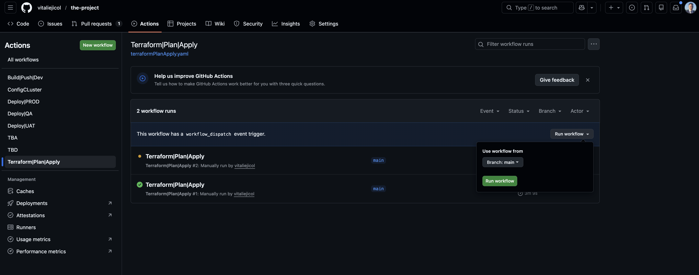
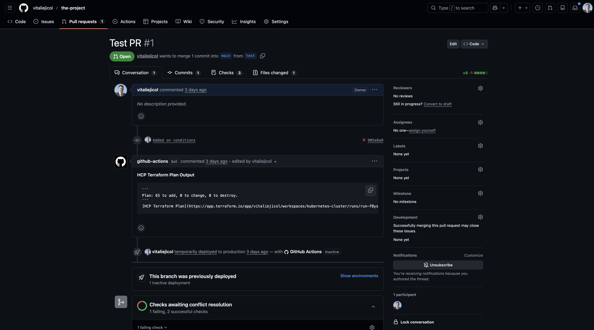
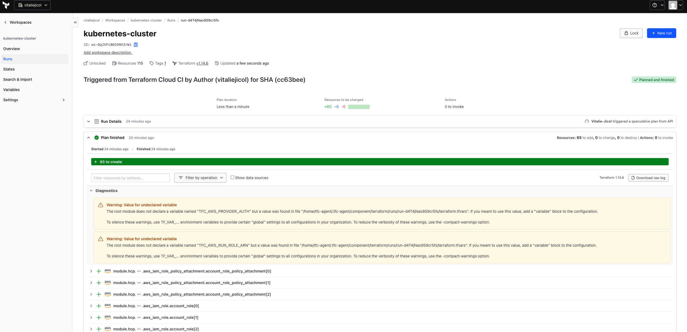
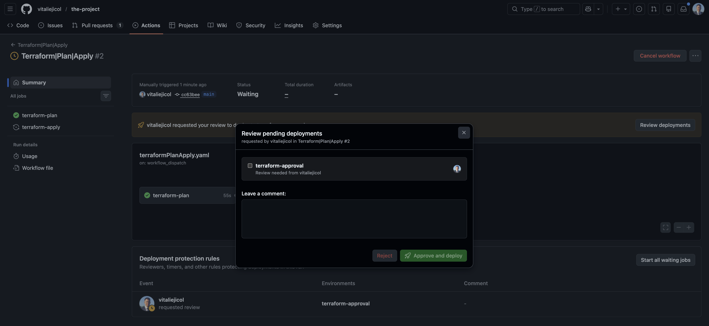
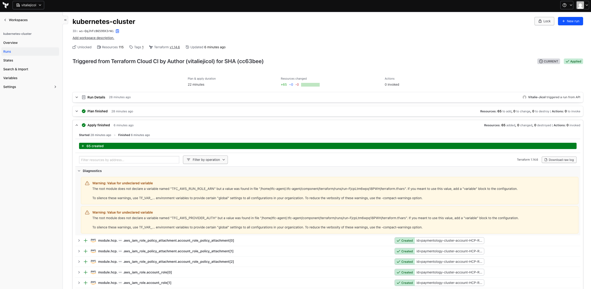
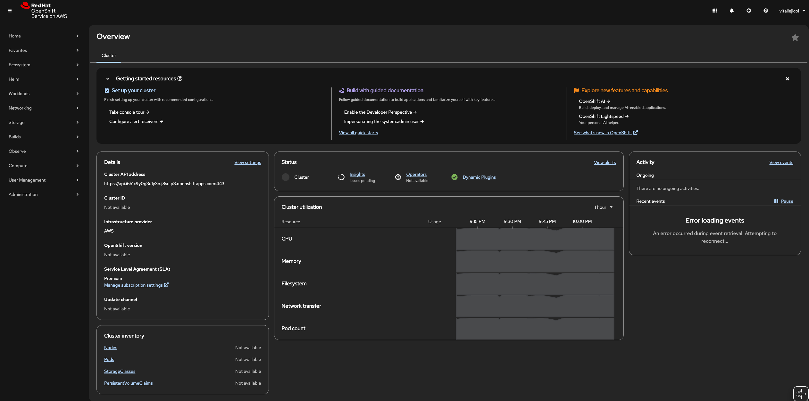
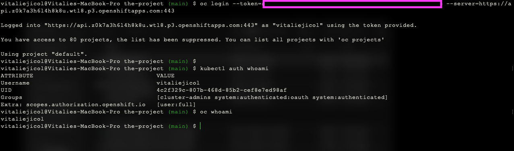

# DevOps Engineer Project

End-to-end DevOps implementation of a containerized microservices system deployed on ROSA AWS (Kubernetes) with full CI/CD automation and environment separation (QA, UAT, PROD).

---

# Architecture Overview

This project demonstrates:

- Containerized services(names I used are for testing purposes)
- Docker image build & push to AWS ECR
- ROSA AWS Kubernetes deployments
- Infrastructure as Code
- CI/CD pipelines using GitHub Actions
- Multi-environment strategy (QA / UAT / PROD)

---

# Repository Structure
<details>

<Summary>Click to expand the Repository Structure</summary>


The repository is structured into two main domains:`aplication` and `infrastructure`. The `application` directory contains service source code, Dockerfiles, and Ansible playbooks for environment-specific deployments(`qa`,`uat`,`prod`). The `infrastructure` directory manages cluster provisioning and configuration using Terraform Ansible,with separate inventories per environment. This structure cleanly separates application deployment logic from infrastructure provisioning.

```
the-project/
├── application
│   ├── ansible
│   │   ├── inventories
│   │   │   ├── prod
│   │   │   │   └── hosts.yml
│   │   │   ├── qa
│   │   │   │   └── hosts.yml
│   │   │   └── uat
│   │   │       └── hosts.yml
│   │   └── playbooks
│   │       ├── deploy-app.yml
│   │       └── roles
│   │           └── kubernetes-deploy
│   │               ├── defaults
│   │               │   └── main.yml
│   │               ├── files
│   │               ├── handlers
│   │               │   └── main.yml
│   │               ├── meta
│   │               │   └── main.yml
│   │               ├── README.md
│   │               ├── tasks
│   │               │   └── main.yml
│   │               ├── templates
│   │               │   ├── deployment.yml.j2
│   │               │   ├── frontend-ingress.yml.j2
│   │               │   ├── networkpolicy.yml.j2
│   │               │   └── service.yml.j2
│   │               ├── tests
│   │               │   ├── inventory
│   │               │   └── test.yml
│   │               └── vars
│   │                   └── main.yml
│   ├── api
│   │   ├── Dockerfile
│   │   └── src
│   ├── frontend
│   │   ├── Dockerfile
│   │   └── src
│   └── worker
│       ├── Dockerfile
│       └── src
├── infrastructure
│   └── cluster
│       ├── ansible
│       │   ├── inventories
│       │   │   ├── cluster-prod
│       │   │   │   └── hosts.yaml
│       │   │   ├── cluster-qa
│       │   │   │   └── hosta.yaml
│       │   │   └── cluster-uat
│       │   │       └── hosts.yaml
│       │   └── playbooks
│       │       ├── cluster-config
│       │       │   ├── defaults
│       │       │   │   └── main.yml
│       │       │   ├── files
│       │       │   ├── handlers
│       │       │   │   └── main.yml
│       │       │   ├── meta
│       │       │   │   └── main.yml
│       │       │   ├── README.md
│       │       │   ├── tasks
│       │       │   │   └── main.yml
│       │       │   ├── templates
│       │       │   ├── tests
│       │       │   │   ├── inventory
│       │       │   │   └── test.yml
│       │       │   └── vars
│       │       │       └── main.yml
│       │       └── config-cluster.yaml
│       └── terraform
│           ├── main.tf
│           ├── provider.tf
│           ├── README.md
│           ├── test.tfvars
│           └── variables.tf
```

</details>

# Part 1 — Infrastructure

<details>

<Summary>Click to expand the Infrastructure details</summary>

The infrastructure is fully provisioned and maned using Infrastructure as Code principles.

### Technologies
- Terraform (ROSA provisioning)
- ECR (Container registry)
- KMS (Key Management Service)
- RDS (Relational Database)
- GitHub Actions (CI/CD Automation)

## Kubernetes Resources

- Namespaces per environment (qa, uat, prod)
- Deployments
- Services (ClusterIP / LoadBalancer)
- Ingress (UAT / PROD only)
- Network Policies

---

## Environment Strategy

| Environment | Purpose | Exposure |
|------------|----------|----------|
| QA  | Internal validation | Internal only |
| UAT | External developer testing | Customer |
| PROD | Customer production | Clients |

## Infrastructure Deployment

The infrastructure deployment provision can be achived by trigger the GitHub Action pipeline:

`Step 1:`

Creating a pull request is optional, but recommended for better visibility

`Step 2`

Start the job. It can be triggered manually or will run automatically when the PR is opened.




`Step 3`

Review the Terraform plan using the link provided in the PR. This will redirect you to Terraform Cloud.





`Step 4`

After reviewing the plan, you will need to approve the Terraform provisioning. Once approved, the deployment will start.





`Step 5`

After the cluster has been provisioned, you can interact with it either via the web console or the terminal.




</details>


# Part 2 — Application

<details>

<Summary>Click to expand the Application details</summary>


CICD Workflow:
- A separate pipeline is triggered for building and pushing Docker images to AWS ECR whenever code changes are commited.
  This ensures the application is tested and packaged independently of environment deployments

- After the image is pushed, each environment has its own deployment pipeline
    QA: internal deployment for testing
    UAT: external deployment for developers
    PROD: customer-facind deployment with approval gating


</details>