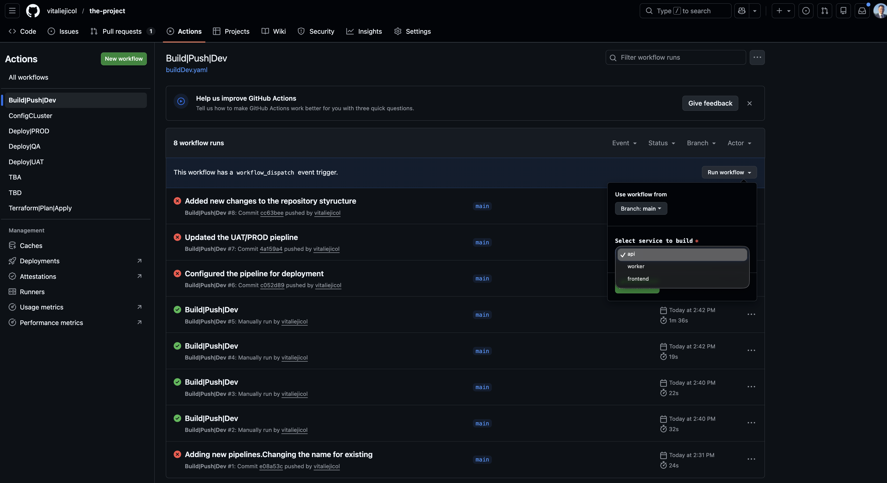
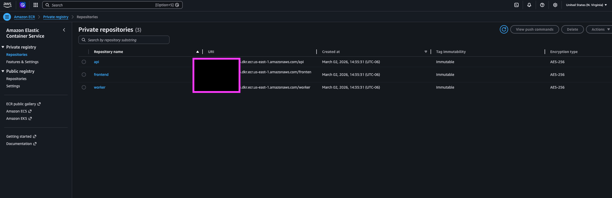
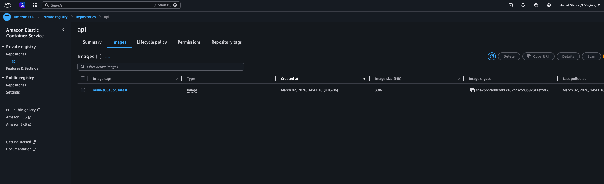
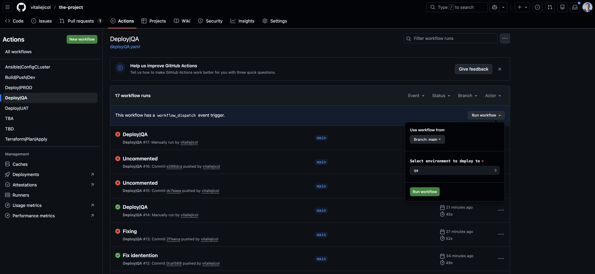
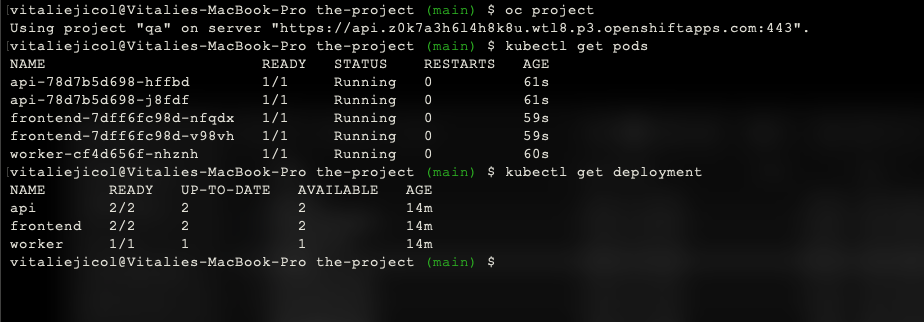

# DevOps Engineer Project

End-to-end DevOps implementation of a containerized microservices system deployed on **ROSA AWS (Kubernetes)** with CI/CD and multi-environment support (QA, UAT, PROD).  

I have virtually split this project into **two parts**: **infrastructure** and **application**.  

- For **infrastructure deployment**, I am using **Terraform modules** to provision cloud resources and **Ansible** to configure Kubernetes and related resources.  
- For **application deployment**, I am using **Ansible only** to manage microservices deployments across different environments.  

This architecture is a **designed baseline and not the final version** — there are many areas for enhancement. Future improvements could include additional infrastructure strategies to increase **high availability, resilience, and scalability**.

---

## Project Considerations

While designing this project, I plan to answer the following key questions to guide the DevOps implementation:

### 1. **What environments will exist?**

  - QA – Internal validation; developers and QA team only.
  - UAT – External testing by developers or customers; mirrors production functionality.
  - PROD – Customer-facing, fully managed production environment.
  - Other environments that can be are development,integration or sandbox.

### 2. **What lifespans will those environments have?**

  - QA – Persistent for ongoing testing; refreshed per sprint or release cycle.
  - UAT – Persistent until testing is complete; can be recycled after each release.
  - PROD – Permanent, only updated with controlled deployments.
  - Ephemeral environments – Short-lived (sandboxes)

### 3. **What processes will manage them?**

  - Terraform/Ansible will manage the Cluster and Cluster Configuration
  - Ansible will manage the environments.

### 4. **What Git repositories/branches/tags will be used?**

  - Repository layout:
      - infrastructure/ – Terraform and Ansible configurations
      - application/ – Ansible

  - Branches:
    - main – Production-ready code
    - dev – Integration testing
    - feature/** – Feature branches for new development
  - Tags:
     - vX.Y.Z – Release versions for production deployments

### 5. **How will those branches/tags be used to promote changes between environments?**

    - Dev → QA: dev branch changes automatically deployed to QA.
    - QA → UAT: After QA validation, merge dev into uat branch; CI/CD deploys to UAT.
    - UAT → PROD: After UAT approval, merge uat into main and tag with vX.Y.Z; production deployment is triggered with GitHub environment approvals.


### 6. **What pipeline automation will exist?**

   - Build&Push, Deploy

### 7. **How will it be written?**  
  
  - GitHub Action YAML workflows
  
### 8. **What tools will be used?**

    - Terraform – Infrastructure provisioning
    - Ansible – Kubernetes configuration and deployment
    - Docker – Containerization
    - Maven – Java/Spring Boot builds
    - GitHub Actions – CI/CD automation
    - ROSA AWS – Managed Kubernetes cluster

### 9. **How will the tools communicate and authenticate with each other and the Kubernetes cluster?**  

    - GitHub Actions ↔ AWS: OIDC assume IAM roles with least privileges
    - Terraform ↔ AWS: OIDC assume IAM roles with least privileges
    - GitHub Action ↔ Ansible ↔ The workflow uses a service account token stored in GitHub Secrets (OPENSHIFT_TOKEN) to authenticate to the OpenShift - - API endpoint (OPENSHIFT_SERVER_URL).
    - Docker ↔ ECR: Login via GitHub Actions (aws-actions/amazon-ecr-login)
    - Microservices communication: Internal via ClusterIP services; no external network access except Frontend/UAT/PROD Ingress

### 10. **How will environment workloads be kept separate on the cluster?**

    - Namespaces: One per environment (qa, uat, prod)
    - Resource quotas & limits: Prevent one environment from consuming all cluster resources
    - NetworkPolicies: Restrict communication to only required pods within the environment
    - RBAC roles: Limit user/service account permissions per environment

### 11. **What accounts exist to effect the deployment?**

    - GitHub Actions – CI/CD runner (uses OIDC to assume AWS role)
      - AWS IAM Roles:
        - Terraform provisioning role
        - Deployment role for GitHub Actions
    - Service Accounts in Kubernetes: Each namespace has SA for microservices with appropriate RBAC
    - Developers / Admins: GitHub access for code, workflow_dispatch triggers

12. **What changes I would add or I will improce?**

---

This section ensures that **every design decision** is intentional, and the project remains **scalable, secure, and maintainable**.

---

# Architecture Overview

This project demonstrates:

- Containerized services(names I used are for testing purposes)
- Docker image build & push to AWS ECR
- ROSA AWS Kubernetes deployments
- Infrastructure as Code
- CI/CD pipelines using GitHub Actions
- Multi-environment strategy (QA / UAT / PROD)

---

# Repository Structure
<details>

<Summary>Click to expand the Repository Structure</summary>


The repository is structured into two main domains:`aplication` and `infrastructure`. The `application` directory contains service source code, Dockerfiles, and Ansible playbooks for environment-specific deployments(`qa`,`uat`,`prod`). The `infrastructure` directory manages cluster provisioning and configuration using Terraform Ansible,with separate inventories per environment. This structure cleanly separates application deployment logic from infrastructure provisioning.

```
the-project/
├── application
│   ├── ansible
│   │   ├── inventories
│   │   │   ├── prod
│   │   │   │   └── hosts.yml
│   │   │   ├── qa
│   │   │   │   └── hosts.yml
│   │   │   └── uat
│   │   │       └── hosts.yml
│   │   └── playbooks
│   │       ├── deploy-app.yml
│   │       └── roles
│   │           └── kubernetes-deploy
│   │               ├── defaults
│   │               │   └── main.yml
│   │               ├── files
│   │               ├── handlers
│   │               │   └── main.yml
│   │               ├── meta
│   │               │   └── main.yml
│   │               ├── README.md
│   │               ├── tasks
│   │               │   └── main.yml
│   │               ├── templates
│   │               │   ├── deployment.yml.j2
│   │               │   ├── frontend-ingress.yml.j2
│   │               │   ├── networkpolicy.yml.j2
│   │               │   └── service.yml.j2
│   │               ├── tests
│   │               │   ├── inventory
│   │               │   └── test.yml
│   │               └── vars
│   │                   └── main.yml
│   ├── api
│   │   ├── Dockerfile
│   │   └── src
│   ├── frontend
│   │   ├── Dockerfile
│   │   └── src
│   └── worker
│       ├── Dockerfile
│       └── src
├── infrastructure
│   └── cluster
│       ├── ansible
│       │   ├── inventories
│       │   │   ├── cluster-prod
│       │   │   │   └── hosts.yaml
│       │   │   ├── cluster-qa
│       │   │   │   └── hosta.yaml
│       │   │   └── cluster-uat
│       │   │       └── hosts.yaml
│       │   └── playbooks
│       │       ├── cluster-config
│       │       │   ├── defaults
│       │       │   │   └── main.yml
│       │       │   ├── files
│       │       │   ├── handlers
│       │       │   │   └── main.yml
│       │       │   ├── meta
│       │       │   │   └── main.yml
│       │       │   ├── README.md
│       │       │   ├── tasks
│       │       │   │   └── main.yml
│       │       │   ├── templates
│       │       │   ├── tests
│       │       │   │   ├── inventory
│       │       │   │   └── test.yml
│       │       │   └── vars
│       │       │       └── main.yml
│       │       └── config-cluster.yaml
│       └── terraform
│           ├── main.tf
│           ├── provider.tf
│           ├── README.md
│           ├── test.tfvars
│           └── variables.tf
```

</details>

# Part 1 — Infrastructure

<details>

<Summary>Click to expand the Infrastructure details</summary>

The infrastructure is fully provisioned and managed using Infrastructure as Code principles.

### Technologies
- Terraform (ROSA provisioning)
- ECR (Container registry)
- KMS (Key Management Service)
- RDS (Relational Database)
- GitHub Actions (CI/CD Automation)

## Kubernetes Resources

- Namespaces per environment (qa, uat, prod)
- Deployments
- Services (ClusterIP / LoadBalancer)
- Ingress (UAT / PROD only)
- Network Policies

---

## Environment Strategy

| Environment | Purpose | Exposure |
|------------|----------|----------|
| QA  | Internal validation | Internal only |
| UAT | External developer testing | Customer |
| PROD | Customer production | Clients |

## Infrastructure Deployment

The infrastructure deployment provision can be achived by trigger the GitHub Action pipeline:

`Step 1:`

Creating a pull request is optional, but recommended for better visibility

`Step 2`

Start the job. It can be triggered manually or will run automatically when the PR is opened.


`Step 3`

Review the Terraform plan using the link provided in the PR. This will redirect you to Terraform Cloud.


`Step 4`

After reviewing the plan, you will need to approve the Terraform provisioning. Once approved, the deployment will start.


`Step 5`

After the cluster has been provisioned, you can interact with it either via the web console or the terminal.


</details>


# Part 2 — Application

<details>

<Summary>Click to expand the Application details</summary>


CICD Workflow:
- A separate pipeline is triggered for building and pushing Docker images to AWS ECR whenever code changes are commited.
  This ensures the application is tested and packaged independently of environment deployments

- After the image is pushed, each environment has its own deployment pipeline
    QA: internal deployment for testing
    UAT: external deployment for developers
    PROD: customer-facind deployment with approval gating


`Step 1`

Build the image and push to AWS ECR repository.








`Step 2`

Deploy to the desired environment. Select the desired pipeline. 






</details>